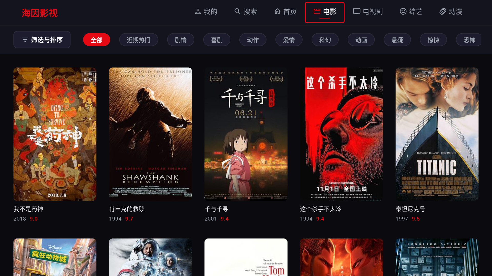

# 海因影视 TV 版

基于 Flutter 开发的智能电视端影视播放应用，面向 Android TV 及大屏设备优化，同时支持 Web 与 Windows 桌面端。



## 功能特性

### 影视浏览

- **首页推荐**：聚合热门影视内容，首页即看即播。
- **分类浏览**：电影、电视剧、综艺、动漫四大频道，支持横向小分类切换。
- **筛选与排序**：分类页支持按类型、地区、年份、特色等维度筛选，并按近期热度、评分、时间等排序。
- **海报网格**：TV 风格海报墙，支持遥控器方向键流畅浏览。

### 详情与选集

- **影片详情**：展示影片简介、评分、演职员、年份等信息。
- **多播放源**：支持切换不同数据源，自动解析可播放地址。
- **剧集选集**：电视剧、综艺、动漫支持多集选择，自动连续播放下一集。

### 全屏播放

- **基础控制**：播放/暂停、快进/快退、进度拖动、音量/亮度调节。
- **画面比例**：支持原始比例、16:9、4:3 等画面比例切换。
- **控制栏自动隐藏**：无操作 10 秒后自动隐藏控制栏，移动/按键后恢复显示。
- **片头片尾跳过**：按电视剧维度设置跳过片段，自动跳过片头片尾并触发下一集。

### 多播放器后端

- 支持 **ExoPlayer**、**MediaKit**、**video_player** 三种播放器后端。
- 可在设置中按需切换，适配不同网络格式（HLS、DASH、SS、普通 MP4）。
- 网络流自动使用 PlatformView 渲染。

### 搜索

- **关键词搜索**：输入片名快速查找。
- **最近搜索**：保存最近搜索记录，方便再次查找。
- **搜索推荐**：提供热门搜索推荐词。
- **三栏布局**：左侧搜索框 + 二维码、中间最近/推荐、右侧搜索结果，TV 焦点独立管理。

### 个人中心

- **播放历史**：记录播放进度，随时续看。
- **收藏夹**：收藏喜欢的影片，方便快速访问。
- **扫码登录**：支持扫码同步账号数据。
- **软件设置**：播放器、数据源、M3U8 代理、缓存管理。
- **检查更新**：支持国内渠道与 GitHub 渠道双源检查，带下载进度与自动安装。

### 应用内更新

- **双渠道更新**：默认国内渠道（GitCode），手动可选 GitHub 渠道。
- **TAG 版本检测**：基于 Release Tag 进行版本比较。
- **下载进度**：更新对话框实时显示 APK 下载百分比与进度条。
- **权限申请**：下载完成后先请求「安装未知应用」权限，再调起系统安装器。
- **防重复点击**：下载过程中按钮禁用，避免用户多次触发。

### TV 遥控优化

- **顶部导航焦点**：首页、电影、电视剧、综艺、动漫、我的之间左右循环，默认聚焦首页。
- **分类页焦点层级**：顶部导航 → 筛选/排序栏 → 海报网格，按上键逐级返回当前分类导航。
- **筛选面板**：返回键优先关闭筛选面板，不触发应用退出；面板内焦点受控，不会逃逸。
- **海报网格**：方向键自由移动，首行按上返回筛选/排序栏。
- **全屏播放遥控**：
  - 左右键：快进/快退。
  - 下键：显示控制栏并进入功能键区域。
  - 确认键：播放/暂停。
  - 返回键：控制栏可见时先隐藏，隐藏后再按返回退出播放。
- **退出确认**：仅在首页按返回时弹出「确认退出」对话框。

### 其他特性

- **M3U8 代理设置**：支持配置代理地址，改善部分网络环境播放体验。
- **数据缓存**：海报、影视数据本地缓存，离线也能浏览已加载内容。
- **Leanback 适配**：AndroidManifest 配置 LEANBACK_LAUNCHER、banner、TV 特性声明。
- **Release 签名**：使用专用密钥库签名，支持应用内增量更新。

## 支持平台

| 平台 | 状态 | 说明 |
|------|------|------|
| Android TV | 主要目标平台 | 支持 LEANBACK_LAUNCHER、遥控器焦点导航 |
| Web | 支持 | 受浏览器 CORS 限制，部分图片资源可能无法加载 |
| Windows | 支持 | 桌面调试与预览 |

## 项目结构

```
hain_tv/
├── android/              # Android 平台配置
│   ├── app/build.gradle.kts
│   ├── key.properties    # 发布签名配置（需妥善保管）
│   └── ...
├── lib/                  # Flutter 业务代码
│   ├── screens/          # 页面
│   ├── widgets/          # 自定义组件
│   ├── player/           # 播放器后端封装
│   ├── services/         # 网络与数据服务
│   ├── focus/            # TV 焦点管理
│   └── models/           # 数据模型
├── scripts/              # 构建脚本（PowerShell）
├── web/                  # Web 平台配置
├── windows/              # Windows 平台配置
└── pubspec.yaml
```

## 环境要求

- Flutter SDK: `^3.12.0`
- Dart SDK: 与 Flutter 版本匹配
- Android SDK: minSdk 21
- JDK: 用于 Android 构建

## 运行与调试

```bash
# 进入项目目录
cd hain_tv

# 获取依赖
flutter pub get

# 运行到 Android TV / 模拟器
flutter run

# 运行到 Web
flutter run -d chrome

# 运行到 Windows
flutter run -d windows
```

## 构建发布包

项目提供 PowerShell 构建脚本，位于 `scripts/` 目录：

```powershell
# 构建 Android TV Release APK
.\scripts\build_android_tv.ps1

# 构建 Web 版本
.\scripts\build_web.ps1

# 生成应用图标
.\scripts\generate_icons.ps1
```

Release 构建会使用 `android/key.properties` 中配置的签名密钥。

## 更新日志

### 1.0.3

- **M3U8 本地去广告**：参考 TVBox 思路实现客户端本地过滤，支持三种播放器后端，默认关闭。
- **自动切换源优化**：开关与等待时间合并为同一设置项，等待时间现在会真正生效。
- **继续播放/播放记录**：海报下方显示播放源名称，不再显示年份。
- **二维码登录修复**：退出登录后可再次扫码登录，无需重启应用。
- **更新弹窗优化**：弹窗更大、日志更完整，下载进度条固定在底部始终可见。
- **分类页默认排序**：电影、电视剧、综艺、动漫除「近期热门」外，默认排序改为「首映时间」。

### 1.0.2

- **收藏夹实时同步**：详情页添加/取消收藏后，“我的”页面立即刷新，无需重启。
- **“我的”页面弹窗重构**：播放记录与收藏夹弹窗更大，支持批量选择、删除与清空，并同步 LunaTV 服务器。
- **分类页海报墙焦点优化**：支持方向键长按、行尾循环跳转，避免焦点异常跳回筛选栏。
- **跳过片头片尾优化**：电视剧自动识别跳过配置，焦点导航更顺畅。

### 1.0.1

- **TV 遥控修复**：控制栏隐藏时确认键可正常播放/暂停；下键显示控制栏后优先聚焦“跳过”按钮。
- **焦点导航修复**：分类页子分类/筛选栏按上键正确返回当前分类导航；筛选面板返回键优先关闭面板，不再误触发退出。
- **播放体验增强**：自动补充 `Referer`/`Origin` 请求头，支持 `proxyMode` 代理，切换源保留当前集数，新增全屏触摸手势与屏幕常亮。
- **应用内更新**：支持国内（GitCode）与 GitHub 双渠道，下载前请求安装权限。
- **跳过片头片尾**：支持 LunaTV 跳过配置，可自动跳过片头、片尾与广告。
- **依赖升级**：`permission_handler` 升级至 `^12.0.3`，并更新多个兼容依赖。

完整更新内容请查看 [CHANGELOG.md](./CHANGELOG.md)。

## 后续更新计划

- **主题色选择**：在设置中提供多套主题色方案，允许用户自定义应用强调色。
- **LunaTV 直播源**：对接 LunaTV 直播源接口，在应用内直接浏览和播放电视直播频道。
- **TVBox 订阅源支持**：尝试解析 TVBox 标准订阅源（如 JSON、TXT 格式），将其作为影视播放源导入与切换。

## 重要：需妥善保管的密钥文件

以下文件包含应用发布签名密钥信息，**切勿提交到 Git 仓库或泄露给第三方**。丢失密钥将导致无法更新已发布的应用。

### 1. `android/key.properties`

- **位置**：`hain_tv/android/key.properties`
- **用途**：配置 Release 签名所需的密钥库密码、别名及密钥库文件路径。
- **内容示例**：
  ```properties
  storePassword=******
  keyPassword=******
  keyAlias=hain_tv_key
  storeFile=hain_tv_keystore.jks
  ```
- **保管要求**：
  - 仅本地保存，不要上传到代码仓库。
  - 已加入 `.gitignore` 忽略规则，请确认不会被误提交。
  - 建议备份到安全的离线存储介质或密码管理器。

### 2. `android/app/hain_tv_keystore.jks`

- **位置**：`hain_tv/android/app/hain_tv_keystore.jks`
- **用途**：Android Release 签名密钥库文件，用于对 APK 进行数字签名。
- **别名**：`hain_tv_key`
- **保管要求**：
  - 这是最重要的密钥文件，丢失后无法为已有应用发布更新。
  - 不要提交到 Git，不要通过邮件、即时通讯工具发送。
  - 建议多重备份（加密 U 盘、私有云、密码管理器等）。

### 检查清单

- [ ] `android/key.properties` 已加入 `.gitignore`
- [ ] `android/app/hain_tv_keystore.jks` 已加入 `.gitignore`
- [ ] 密钥文件已备份到安全位置
- [ ] 未在代码、日志或文档中硬编码真实密码

## 注意事项

- Release 构建前请确认 `android/key.properties` 与 `hain_tv_keystore.jks` 路径正确且文件存在。
- 若在不同机器上构建，需要将 `hain_tv_keystore.jks` 文件复制到对应路径，并自行创建或更新 `android/key.properties`。
- Web 端受浏览器 CORS 策略限制，部分网络图片可能无法正常显示；Android / TV 端不受影响。
- 国内渠道（GitCode）更新可能与 GitHub 存在同步延迟，如需测试最新版本可选择 GitHub 渠道。

## 许可证

本项目为私有项目，未经授权不得分发或商用。
