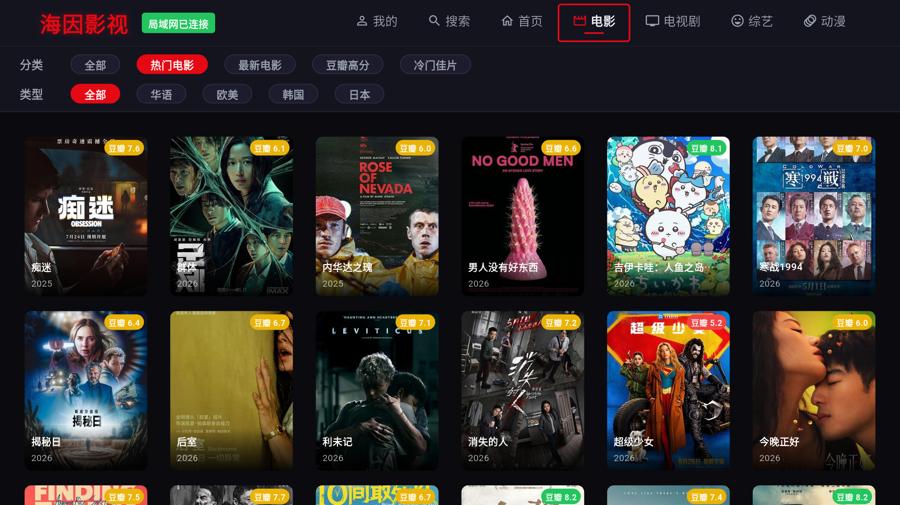
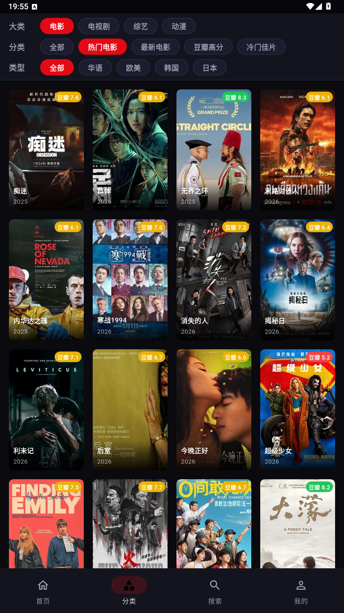

# 海因影视

基于 Flutter 开发的跨平台影视播放应用。TV 版面向 Android TV 及大屏设备优化，支持遥控器焦点导航；tvLegacy 版兼容 Android 5.0+ 低版本电视设备；手机版为竖屏触屏版本，与 TV 版共用业务层。同时支持 Web 与 Windows 桌面端。

v1.2.5 新增「互联网服务器地址优先解析 IPv6」开关，为国内仅有 IPv6 公网、IPv4 受限的环境提供 IPv6 优先解析与自动回退 IPv4 能力，并统一复用 LunaTV API 的 HTTP 客户端，减少重复连接开销；v1.2.4 优化 TV 版渲染后端策略与若干界面显示问题：普通 TV 版改回 Vulkan（Impeller）以适配新设备，tvLegacy 继续用 OpenGL ES 兼容旧设备，修复 TV 版「获取日志」与软件介绍二维码显示不全的问题，并缩小 TV 更新日志字体避免内容溢出。

| TV / Windows 版界面预览 | 手机版界面预览 |
| :--- | :--- |
|  |  |

## 功能特性

### 影视浏览

- **首页推荐**：聚合热门影视内容，首页即看即播。
- **分类浏览**：电影、电视剧、综艺、动漫四大频道，支持横向小分类切换。
- **筛选与排序**：分类页支持按类型、地区、年份等维度筛选，并按近期热度、评分、时间等排序。
- **海报网格**：TV 风格海报墙，支持遥控器方向键流畅浏览；海报右上角展示豆瓣评分，动漫「每日放送」展示 Bangumi 评分。

### 详情与选集

- **影片详情**：展示影片简介、豆瓣评分、演职员、年份、地区、语言、集数、时长等信息；动漫「每日放送」同时展示 Bangumi 评分。
- **多播放源**：支持切换不同数据源，自动解析可播放地址。
- **剧集选集**：电视剧、综艺、动漫支持多集选择，自动连续播放下一集。

### 全屏播放

- **基础控制**：播放/暂停、快进/快退、进度拖动、音量/亮度调节。
- **画面比例**：支持原始比例、16:9、4:3 等画面比例切换。
- **控制栏自动隐藏**：无操作 10 秒后自动隐藏控制栏，移动/按键后恢复显示。
- **片头片尾跳过**：按电视剧维度设置跳过片段，自动跳过片头片尾并触发下一集。

### 多播放器后端

- **Android TV / Android 手机 / 平板**：默认使用 **ExoPlayer**，适配 HLS、DASH、普通 MP4 等主流网络格式。
- **Windows**：抛弃长期未更新的 `flutter_mpv`，默认使用 **fvp**，并保留 **vlc_player** 作为备用后端，提升桌面端格式兼容性与播放稳定性。
- 优化视频缓冲配置与测速优选逻辑，详情页自动对所有播放源测速并按响应速度排序，无播放记录时完成测速后再允许播放。

### 互联网与局域网自动切换

- **双服务器配置**：登录页与服务器管理页同时支持配置「互联网服务器地址」与「局域网服务器地址」，适应公网与内网不同访问场景。
- **启动自动测速**：每次启动时自动对两个服务器地址进行延迟测速，选择当前可达且延迟最低的地址作为实际连接服务器。
- **实时连接状态**：首页顶部显示服务器连接状态：互联网已连接（蓝色）、局域网已连接（绿色）、未连接（红色），一目了然当前走哪条线路。
- **一键手动切换**：在「我的-服务器管理」中可手动触发测速并立即切换到最优服务器。

### IPv6 优先解析

针对目前国内仅有 IPv6 公网、IPv4 受限或访问不畅的环境，「我的-服务器管理」中新增「互联网服务器地址优先解析 IPv6」开关（默认关闭）。开启后，App 会优先解析互联网服务器的 IPv6 地址；当 IPv6 网络不可达时自动回退到 IPv4，无需手动切换。该设置仅作用于互联网服务器，局域网服务器不受影响，继续沿用系统默认解析策略。目前国内大量软件对 IPv6 地址解析与回退的适配仍不完善，该功能可在纯 IPv6 环境下提升服务器连通性与访问成功率。

### 双账号快速切换

- **主/子两个账号槽位**：在「我的-账号管理」中可分别保存主账号与子账号的登录凭据，方便使用不同播放源的账号。
- **一键切换**：无需重新输入密码，一键在主/子账号之间切换，切换后自动刷新首页与播放记录。
- **扫码配置子账号**：TV 端支持手机扫码快速输入子账号，子账号配置完成后立即切换并刷新数据。

### 搜索

- **关键词搜索**：输入片名快速查找。
- **最近搜索**：保存最近搜索记录，方便再次查找。
- **搜索推荐**：提供热门搜索推荐词。
- **三栏布局**：左侧搜索框 + 二维码、中间最近/推荐、右侧搜索结果，TV 焦点独立管理。
- **源搜索优化**：详情页搜索播放源时增量显示，模糊搜索自动剥离季/年番等后缀，提升命中率和响应速度。

### 个人中心

- **播放历史**：记录播放进度，随时续看。
- **收藏夹**：收藏喜欢的影片，本地优先存储并立即展示，后台异步同步到 LunaTV 服务器，离线也能浏览已收藏内容。
- **服务器管理**：分别配置互联网/局域网服务器地址，开启启动自动测速，手动触发测速切换。
- **账号管理**：主/子双账号槽位，一键快速切换，TV 端支持扫码配置子账号。
- **服务器连接状态**：顶部状态栏实时显示 LunaTV 服务器连接状态：互联网已连接（蓝色）、局域网已连接（绿色）、未连接（红色）。
- **扫码登录**：支持扫码同步账号数据。
- **软件设置**：播放器后端、硬件解码、数据源、M3U8 代理、M3U8 本地去广告、缓冲模式、缓存管理。
- **检查更新**：默认国内渠道，可选 GitHub 渠道，带下载进度与自动安装。

### 应用内更新

- **双渠道更新**：默认国内渠道（GitCode），可切换 GitHub 渠道作为默认更新。
- **TAG 版本检测**：基于 Release Tag 进行版本比较。
- **下载进度**：更新对话框实时显示 APK 下载百分比与进度条。
- **权限申请**：下载完成后先请求「安装未知应用」权限，再调起系统安装器。
- **防重复点击**：下载过程中按钮禁用，避免用户多次触发。

### TV 遥控优化

- **顶部导航焦点**：我的、搜索、首页、电影、电视剧、综艺、动漫之间左右循环，默认聚焦首页。
- **分类页焦点层级**：顶部导航 → 筛选/排序栏 → 海报网格，按上键逐级返回当前分类导航。
- **筛选面板**：返回键优先关闭筛选面板，不触发应用退出；面板内焦点受控，不会逃逸。
- **海报网格**：方向键自由移动，首行按上返回筛选/排序栏。
- **全屏播放遥控**：
  - 左右键：快进/快退。
  - 下键：显示控制栏并进入功能键区域。
  - 确认键：播放/暂停。
  - 返回键：控制栏可见时先隐藏，隐藏后再按返回退出播放。
- **退出确认**：仅在首页按返回时弹出「确认退出」对话框。

### 其他特性

- **M3U8 代理设置**：支持配置代理地址，改善部分网络环境播放体验。
- **M3U8 本地去广告**：参考 TVBox 思路在客户端本地过滤 M3U8 广告，默认关闭，可在播放器设置中开启。
- **数据缓存**：海报、影视数据本地缓存，离线也能浏览已加载内容。
- **Leanback 适配**：AndroidManifest 配置 LEANBACK\_LAUNCHER、banner、TV 特性声明。
- **Release 签名**：使用专用密钥库签名，支持应用内增量更新。

## 支持平台

| 平台            | 状态     | 系统要求                  | 说明                                           |
| ------------- | ------ | --------------------- | -------------------------------------------- |
| Android TV    | 主要目标平台 | Android 7.0+（API 24+） | 支持 LEANBACK\_LAUNCHER、遥控器焦点导航；推荐使用 **Vulkan（Impeller）** 渲染。 |
| Android tvLegacy | 已发布    | Android 5.0+（API 21+） | 低版本 Android TV 兼容版本，功能与 TV 版一致；使用 **OpenGL ES** 渲染，适配旧设备/旧安卓版本。 |
| Android       | 已发布    | Android 7.0+（API 24+） | 手机 / 平板竖屏触屏版本，可在 GitCode / GitHub Release 下载 |
| Web           | 支持     | 现代浏览器                 | 仅用于本地测试，受浏览器 CORS 限制，部分图片资源可能无法加载            |
| Windows       | 已发布    | Windows 10 1809+      | 桌面端便携版，默认使用 `fvp`，备用 `vlc_player`            |
| Linux         | 计划中    | —                     | 桌面端版本后续支持                                    |
| iOS           | 计划中    | —                     | 移动端版本后续支持                                    |

### Release 文件说明

| 文件名                                   | 适用设备              | 系统要求                  | 说明                               |
| ------------------------------------- | ----------------- | --------------------- | -------------------------------- |
| `heinplay-1.2.5-tv.apk`               | Android TV / 电视盒子 | Android 7.0+（API 24+） | 横屏 Leanback 设计，Vulkan 渲染。如果你发现安装闪退，请尝试 tvLegacy。 |
| `heinplay-1.2.5-tvLegacy.apk`            | Android TV / 电视盒子 | Android 5.0+（API 21+） | 横屏 Leanback 设计，兼容低版本 Android 设备，OpenGL ES 渲染。 |
| `heinplay-1.2.5-mobile.apk`           | Android 手机 / 平板   | Android 7.0+（API 24+） | 竖屏触屏 UI，支持手势与屏幕旋转。               |
| `heinplay-1.2.5-windows-portable.zip` | Windows 10/11 电脑  | Windows 10 1809+      | 解压即用，无需安装。                       |

## 项目结构

```
hain_tv/
├── android/              # Android 平台配置
│   ├── app/build.gradle.kts
│   ├── key.properties    # TV 版发布签名配置（需妥善保管）
│   ├── key-tvlegacy.properties # tvLegacy 版发布签名配置（需妥善保管）
│   └── ...
├── lib/                  # Flutter 业务代码
│   ├── screens/          # 页面
│   ├── widgets/          # 自定义组件
│   ├── player/           # 播放器后端封装
│   ├── services/         # 网络与数据服务
│   ├── focus/            # TV 焦点管理
│   └── models/           # 数据模型
├── scripts/              # 构建脚本（PowerShell）
├── web/                  # Web 平台配置
├── windows/              # Windows 平台配置
└── pubspec.yaml
```

## 环境要求

- Flutter SDK: `^3.12.0`
- Dart SDK: 与 Flutter 版本匹配
- Android SDK: minSdk 24（Android 7.0+）；tvLegacy 版 minSdk 21（Android 5.0+）
- JDK: 用于 Android 构建

## 运行与调试

```bash
# 进入项目目录
cd hain_tv

# 获取依赖
flutter pub get

# 运行到 Android TV / 模拟器
flutter run

# 运行到 Web
flutter run -d chrome

# 运行到 Windows
flutter run -d windows
```

## 构建发布包

### 一键全平台构建（推荐）

项目根目录下的 `build_all.bat` 是 HeinPlay 全平台一键构建入口，实际构建逻辑由同目录的 `build_all.ps1` 实现。运行后会依次完成：

1. **Flutter 环境检查**：运行 `flutter doctor`。
2. **依赖准备**：执行 `flutter pub get`。
3. **Windows 原生依赖检查**：检测并清理损坏或版本错误的 `mpv-dev` / `ANGLE` 等 `.7z` 依赖包，确保 CMake 使用正确版本重新解压。
4. **Android 签名完整性检查**：验证 TV 版（`android/key.properties`）、tvLegacy 版（`android/key-tvlegacy.properties`）与手机版（`android/key-mobile.properties`）签名配置及 keystore 文件是否存在。
5. **分平台构建**：按需构建手机版、TV 版、tvLegacy 版、Windows 版，失败时输出对应日志路径与最近 30 行日志。
6. **结果汇总**：构建成功后输出产物可点击链接（apk / zip），并在最后汇总成功/失败/跳过状态。

```bash
# 交互式菜单（最常用）
e:\code\HeinPlay\build_all.bat

# 非交互式：跳过 doctor，仅构建 Windows 版
e:\code\HeinPlay\build_all.bat -SkipDoctor -SkipMobile -SkipTv

# 非交互式：跳过 doctor，构建全部版本
e:\code\HeinPlay\build_all.bat -SkipDoctor
```

- 产物输出目录：`hain_tv/dist/`
- 构建日志目录：`hain_tv/logs/`

### 单独构建

项目也提供独立的 PowerShell 构建脚本，位于 `hain_tv/scripts/` 目录：

```powershell
# 构建 Android TV Release APK
.\hain_tv\scripts\build_tv.ps1

# 构建 Android tvLegacy Release APK（Android 5.0+）
.\hain_tv\scripts\build_tvlegacy.ps1

# 构建 Android 手机版 Release APK
.\hain_tv\scripts\build_mobile.ps1

# 构建 Windows 便携版
.\hain_tv\scripts\build_windows.ps1

# 构建 Web 版本
.\hain_tv\scripts\build_web.ps1

# 生成应用图标
.\hain_tv\scripts\generate_icons.ps1
```

Release 构建会使用 `android/key.properties`（TV 版）、`android/key-tvlegacy.properties`（tvLegacy 版）或 `android/key-mobile.properties`（手机版）中配置的签名密钥。详细构建说明请查看 [BUILD_GUIDE.md](./BUILD_GUIDE.md)。

## 更新日志

<details open>
<summary><strong>1.2.0</strong></summary>

### 1.2.5

- **互联网服务器 IPv6 优先解析**：全版本「我的-服务器管理」新增「互联网服务器地址优先解析 IPv6」开关，默认关闭。开启后优先解析互联网服务器的 IPv6 地址，IPv6 不可达时自动回退到 IPv4，无需手动切换；仅作用于互联网服务器，局域网服务器不受影响。针对目前国内大量软件对 IPv6 解析与回退适配不完善的问题，提升仅有 IPv6 公网环境下的服务器连通性与访问成功率。
- **LunaTV API 共享 HTTP 客户端**：多个 LunaTV API 请求复用同一 HTTP 客户端，减少重复的 DNS 解析与 TCP/TLS 连接开销；服务器地址或 DNS 偏好变更时自动重建连接。
- **版本号统一**：全项目更新至 `1.2.5`（build `+17`），Release 产物命名同步为 `heinplay-1.2.5-tv.apk`、`heinplay-1.2.5-tvLegacy.apk`、`heinplay-1.2.5-mobile.apk`、`heinplay-1.2.5-windows-portable.zip`。

### 1.2.4

- **TV 渲染后端策略调整**：普通 TV 版默认使用 **Vulkan（Impeller）** 渲染后端，推荐新设备使用；tvLegacy 版维持 **OpenGL ES** 渲染，继续兼容 Android 5.0+ 旧设备与低版本电视盒子。
- **新增获取日志功能**：全版本设置页新增「获取日志」开关；开启后 TV 版显示局域网日志下载二维码，手机版与 Windows 版显示日志保存路径，方便反馈问题时导出日志。
- **README 增加反馈问题说明**：新增「获取日志与反馈问题」章节，说明如何开启日志、各平台取日志方式，以及反馈问题需要提供的设备型号、系统版本、应用版本、复现步骤、截图和日志等信息。
- **TV 版界面显示优化**：优化设置页「获取日志」二维码、软件介绍仓库二维码与更新日志弹窗的布局与字号，避免低分辨率电视显示不全。
- **版本号统一**：全项目更新至 `1.2.4`（build `+16`），Release 产物命名同步为 `heinplay-1.2.4-tv.apk`、`heinplay-1.2.4-tvLegacy.apk`、`heinplay-1.2.4-mobile.apk`、`heinplay-1.2.4-windows-portable.zip`。

### 1.2.3

- **自动测速开关**：全版本设置页新增「进入详情页自动测速」开关，默认开启；关闭后无播放记录的豆瓣/Bangumi 详情页在搜索源完成后即可播放与选集。
- **手动测速后台继续**：关闭自动测速后，用户手动触发测速仍可进入播放，测速在后台继续完成排序，行为与有播放记录时一致。
- **TV 服务器管理二维码优化**：「我的-服务器管理」二维码输入页面默认带入电视端已保存的互联网/局域网地址；手机提交时空字段不再覆盖电视端原有地址。
- **TV 兼容性优化**：移除全局 Impeller 禁用，改为仅 TV/tvLegacy  flavor 禁用 Impeller，手机版继续保留 Vulkan，提升老机顶盒/低版本电视设备兼容性。
- **版本号统一**：全项目更新至 `1.2.3`（build `+15`），Release 产物命名同步为 `heinplay-1.2.3-tv.apk`、`heinplay-1.2.3-tvLegacy.apk`、`heinplay-1.2.3-mobile.apk`、`heinplay-1.2.3-windows-portable.zip`。

### 1.2.2

- **去广告播放优化**：优化 M3U8 本地去广告与代理逻辑，提升含广告源播放稳定性；修复去广告开关状态在设置页偶发不一致的问题。
- **服务器连接判断优化**：启动与手动测速时并发探测互联网/局域网服务器，首个可用地址立即生效，降低无网或慢网场景下的等待与误判。
- **搜索体验修复**：搜索页恢复原版模糊搜索逻辑，修复快速切换搜索时并发请求未取消导致结果混乱的问题。
- **FVP 自动连播修复**：修复 FVP 播放完一集后未自动播放下一集的问题，并统一三端连播兜底逻辑。
- **tvLegacy 兼容性增强**：为 Android 5.x 设备单独降级 Media3/ExoPlayer 版本，修复因 API 21/22 缺失 `AudioDeviceCallback`、`checkSelfPermission`、`getLocales` 等导致的播放闪退，并补充 Android 5.x 缺失的 Let's Encrypt 根证书信任。
- **详情页与播放记录/收藏夹打通**：首页继续播放、播放记录、收藏夹点击进入的详情页优先展示豆瓣信息；收藏夹新增保存豆瓣 ID，旧记录可通过标题自动匹配豆瓣兜底，即使原始源失效也能展示豆瓣详情页。
- **详情页手动模糊搜索统一**：自动搜索无源时的手动模糊搜索改为与「搜索」分类页一致的搜索逻辑。
- **版本号统一**：全项目更新至 `1.2.2`，Release 产物命名同步为 `heinplay-1.2.2-tv.apk`、`heinplay-1.2.2-tvLegacy.apk`、`heinplay-1.2.2-mobile.apk`、`heinplay-1.2.2-windows-portable.zip`。

### 1.2.1

- **Windows 播放页小窗模式**：播放控制栏新增「小窗播放/恢复窗口」按钮，可将播放窗口一键切换为右下角小窗（默认 480×270）并继续播放；小窗支持鼠标拖动、双击恢复/全屏、四周热区自由拉伸，退出小窗后自动恢复原窗口尺寸或全屏状态。
- **Windows 播放页窗口置顶**：播放控制栏新增「窗口置顶/取消置顶」按钮，普通窗口与小窗模式均可切换置顶，全屏切换时自动同步置顶状态。
- **双服务器连接速度优化**：启动时与「我的-服务器管理」页触发测速时，所有候选地址并发请求，首个返回 200/401 的地址立即被采用，无需等待慢地址超时。
- **搜索速度优化**：精简搜索变体、减少并发 API 调用，搜索结果增量刷新，先展示 LunaTV 原始结果再补充海报/豆瓣信息，降低等待与黑屏时间。
- **双账号搜索历史隔离**：本地搜索历史 key 改为 `search_history_<username>`，主/子账号分别保存，切换账号互不干扰。
- **搜索页焦点与灰屏修复**：修复 TV 版在「正在补充海报信息」阶段焦点无法移动到搜索结果海报的问题，修复 Windows 版搜索过程中结果区偶发灰屏的问题；根因是搜索结果海报 `FocusNode` 被同步 dispose 导致旧 widget 访问已释放节点，已改为延迟释放并增加长度校验防御。
- **版本号统一**：全项目更新至 `1.2.1`，Release 产物命名同步为 `heinplay-1.2.1-tv.apk`、`heinplay-1.2.1-tvLegacy.apk`、`heinplay-1.2.1-mobile.apk`、`heinplay-1.2.1-windows-portable.zip`。

### 1.2.0

- **互联网/局域网双服务器自动切换**：登录页与服务器管理页支持分别配置互联网服务器与局域网服务器，启动时自动测速并选择延迟最低的可用地址，首页实时显示当前连接状态（互联网/局域网/未连接）。
- **主/子双账号快速切换**：新增账号管理页面，支持保存主账号与子账号，一键切换无需重新输入密码；TV 端支持手机扫码快速配置子账号，方便使用不同播放源的账号。
- **新增 tvLegacy 版本**：针对 Android 5.0+（API 21+）电视设备推出独立 `tvlegacy` 构建，功能与 TV 版一致，使用独立签名密钥，可与 TV 版并行安装。
- **播放体验优化**：播放控制栏新增缓冲条，修复切换播放器时双加载图标重叠问题；手机版全屏播放默认保持视频原始比例。
- **更新设置管理**：默认更新渠道为国内渠道，现在支持切换为 github 作为默认更新渠道。
- **版本号统一**：全项目更新至 `1.2.0`，Release 产物命名同步为 `heinplay-1.2.0-tv.apk`、`heinplay-1.2.0-tvLegacy.apk`、`heinplay-1.2.0-mobile.apk`、`heinplay-1.2.0-windows-portable.zip`。

</details>

<details>
<summary><strong>1.1.0</strong></summary>

### 1.1.6

- **播放器后端重构**：Windows 端抛弃长期不更新的 `flutter_mpv`，默认切换为 `fvp`，并新增 `vlc_player` 作为备用后端，解决部分源播放失败问题。
- **视频缓冲与测速优选优化**：重构详情页播放源测速逻辑，自动对所有源进行连通性与响应速度测试，按速度实时排序；无播放记录时完成测速后再启用播放按钮。
- **M3U8 播放体验优化**：统一播放器代理与请求头补全逻辑，M3U8/playlist 强制完整请求并返回 200，仅分片请求透传 Range，提升进度条与播放稳定性。
- **构建与依赖**：`vlc_player` 改为仅 Windows 平台的本地依赖，避免 Android 构建引入 `libvlc-all` 导致 `.so` 冲突与 `minSdk` 抬升。
- **版本号统一**：全项目更新至 `1.1.6`，Release 产物命名同步为 `heinplay-1.1.6-tv.apk`、`heinplay-1.1.6-mobile.apk`、`heinplay-1.1.6-windows-portable.zip`。

### 1.1.5

- **每日放送中文详情与评分修复**：Bangumi 请求优先获取中文内容，详情页优先展示豆瓣评分并在无匹配时回退到 Bangumi，海报墙评分标签统一按分数段着色。
- **设置页提示可读性修复**：TV / 手机设置页所有切换操作 SnackBar 提示文字统一为白色，避免深色背景下看不清。
- **稳定性优化**：手机版全屏退出顺序化销毁资源，降低卡死概率；Windows 版异步刷新日志并快速关闭窗口。
- **GitHub Actions 自动构建**：新增 `.github/workflows/build-release.yml`，改为仅支持手动触发，自动产出 TV / 手机 / Windows 三个版本。
- **权限精简**：取消启动时获取存储读取权限，缓存、更新下载、播放记录与收藏均使用应用私有目录，功能不受影响。
- **依赖升级**：`window_manager` 升级至 `^0.5.2`，并更新多个兼容依赖。
- **版本号统一**：全项目更新至 `1.1.5`，Release 产物命名同步为 `heinplay-1.1.5-tv.apk`、`heinplay-1.1.5-mobile.apk`、`heinplay-1.1.5-windows-portable.zip`。

### 1.1.4

- **Windows 桌面端正式发布**：统一使用 `flutter_mpv`，新增 Windows 日志、用户数据便携化、ESC 返回与全屏切换等桌面交互。
- **全平台数据刷新重构**：首次进入首页强制全量同步播放记录与收藏夹并缓存，播放后增量刷新首页与「我的」。
- **播放体验优化**：收藏夹点击统一进入详情页，详情页与播放页实时同步播放源，换源永久可用并显示测速排名。
- **Release 文件命名统一**：`heinplay-1.1.4-tv.apk`、`heinplay-1.1.4-mobile.apk`、`heinplay-1.1.4-windows-portable.zip`。

### 1.1.3

- **手机版正式发布**：新增 Android 手机版入口，与 TV 版共用业务层但拥有独立的竖屏触屏 UI；支持首页、分类、搜索、个人中心四大模块；播放器支持屏幕旋转与横竖屏自适应；构建产物区分 `tv` / `mobile` 两个 Flavor，使用不同包名与签名密钥。手机版 APK 可在 GitCode / GitHub Release 页面下载。
- **TV 版「我的」页仓库二维码**：在软件介绍区域新增国内仓库与 GitHub 仓库二维码，方便手机扫码下载。
- 应用版本号统一更新至 `1.1.3`。

### 1.1.2（紧急更新）

- **解决 Bangumi 被墙问题**：新增 Bangumi 数据代理与图片代理设置，默认使用 CMLiussss 反代，恢复动漫「每日放送」的数据与海报加载。
- **动漫分类默认页调整**：默认进入「番剧」而非「每日放送」，避免启动时因 Bangumi 访问失败直接报错。
- **分类切换请求取消**：从「每日放送」切到「番剧」/「剧场版」时立即中断 Bangumi 请求，防止旧请求结果覆盖当前页面。

### 1.1.1

- **搜索体验优化**：LunaTV 搜索超时从 8 秒延长至 30 秒，彻底解决长篇动漫（如《名侦探柯南》）因搜索结果集过大导致的超时失败；模糊搜索新增基础标题变体生成，自动剥离「年番/季/部」等后缀，带后缀标题也能命中播放源。
- **详情页搜索源增量显示**：详情页搜索播放源时搜到一个立即显示一个，不再等全部变体搜完，显著减少搜索等待和黑屏时间。
- **分类页海报墙重构**：海报尺寸整体缩小，一屏完整显示两行海报；豆瓣评分显示在海报右上角，动漫「每日放送」使用 Bangumi 评分。
- **详情页信息扩展**：新增导演、编剧、主演、首播日期、地区、语言、集数、时长等影片信息；缩小海报尺寸，让选集与播放源区域更紧凑。
- **播放记录实时刷新**：详情页播放退出后立即刷新播放记录，无需退回首页。
- **焦点交互修复**：分类标签按下键仅移动焦点到筛选行，不再误切换分类；修复设置页 M3U8 去广告开关状态不一致的问题。
- **品牌视觉优化**：顶部「海因影视」标题改为 Logo 风格发光字。

### 1.1.0

- **分类架构重构**：对电影、电视剧、综艺、动漫全分类进行底层焦点逻辑重构，统一顶部导航 → 筛选栏 → 海报墙的焦点层级，彻底解决长期存在的焦点跳转异常问题，TV 遥控体验一致性大幅提升。
- **影片加载优化**：调整播放器初始化时机与预加载策略，修复切换播放源时的双加载圈问题，显著减少点播过程中的黑屏等待时间，低配置设备上效果更明显。
- **动漫分类焦点修复**：「番剧」「剧场版」按下键正确移动到筛选行，不再误切换分类；「每日放送」星期行支持完整左右循环。
- **电影分类排序精简**：电影「全部」移除「综合排序」选项，仅保留「近期热度」「首映时间」「高分优先」。
- **默认排序调整**：电影、电视剧、综艺「全部」以及动漫「番剧」「剧场版」默认排序统一改为「近期热度」。
- **海报墙上键焦点层级修复**：分类页与首页从海报墙/内容区长按上键时，焦点正确回到当前页面对应的顶部导航项，不再跳到「我的」。
- **启动崩溃修复**：修复 `main()` 中未初始化 Flutter Binding 就请求存储权限导致的空指针异常。

</details>

<details>
<summary><strong>1.0.0</strong></summary>

### 1.0.3

- **M3U8 本地去广告**：参考 TVBox 思路实现客户端本地过滤，支持三种播放器后端，默认关闭。
- **自动切换源优化**：开关与等待时间合并为同一设置项，等待时间现在会真正生效。
- **继续播放/播放记录**：海报下方显示播放源名称，不再显示年份。
- **二维码登录修复**：退出登录后可再次扫码登录，无需重启应用。
- **更新弹窗优化**：弹窗更大、日志更完整，下载进度条固定在底部始终可见。
- **分类页默认排序**：电影、电视剧、综艺、动漫除「近期热门」外，默认排序改为「首映时间」。

### 1.0.2

- **收藏夹实时同步**：详情页添加/取消收藏后，“我的”页面立即刷新，无需重启。
- **“我的”页面弹窗重构**：播放记录与收藏夹弹窗更大，支持批量选择、删除与清空，并同步 LunaTV 服务器。
- **分类页海报墙焦点优化**：支持方向键长按、行尾循环跳转，避免焦点异常跳回筛选栏。
- **跳过片头片尾优化**：电视剧自动识别跳过配置，焦点导航更顺畅。

### 1.0.1

- **TV 遥控修复**：控制栏隐藏时确认键可正常播放/暂停；下键显示控制栏后优先聚焦“跳过”按钮。
- **焦点导航修复**：分类页子分类/筛选栏按上键正确返回当前分类导航；筛选面板返回键优先关闭面板，不再误触发退出。
- **播放体验增强**：自动补充 `Referer`/`Origin` 请求头，支持 `proxyMode` 代理，切换源保留当前集数，新增全屏触摸手势与屏幕常亮。
- **应用内更新**：支持国内（GitCode）与 GitHub 双渠道，下载前请求安装权限。
- **跳过片头片尾**：支持 LunaTV 跳过配置，可自动跳过片头、片尾与广告。
- **依赖升级**：`permission_handler` 升级至 `^12.0.3`，并更新多个兼容依赖。

</details>

完整更新内容请查看 [CHANGELOG.md](./CHANGELOG.md)。

## 获取日志与反馈问题

遇到播放失败、闪退、焦点异常、界面显示不全等问题时，欢迎通过 GitHub / GitCode Issues 或相关交流群反馈。为了高效定位问题，请按以下步骤提供日志和必要信息：

### 开启并获取日志

1. 进入「我的 → 软件设置 → 获取日志」，打开开关。
2. 返回出现问题的地方，**复现一次问题**（例如播放失败、页面显示不全、闪退等），让日志记录到出错过程。
3. 重新进入「我的 → 软件设置 → 获取日志」，按平台方式取出日志：
   - **TV 版**：使用手机扫描页面上显示的二维码，下载日志文件到手机后发送。
   - **手机版 / Windows 版**：页面会显示日志保存路径，进入对应目录复制 `hain_tv_log_*.txt` 文件。
4. 反馈时请将日志文件作为附件上传；若文件较大，可压缩为 `.zip` 或 `.rar`。

### 反馈问题请提供的信息

- **设备型号**：如 Xiaomi TV Box 4、海信 55E3F、Samsung SM-S9360 等。
- **系统版本**：如 Android 14、Android 10、Android 5.1、Windows 11 等。
- **应用版本**：如 `1.2.4-tv`、`1.2.4-tvLegacy`、`1.2.4-mobile`、`1.2.4-windows`。
- **问题描述**：具体现象是什么？能否稳定复现？
- **复现步骤**：从哪个页面开始，点击了什么，出现了什么结果。
- **相关截图 / 照片**：TV 版问题建议手机拍摄电视屏幕；界面显示类问题请附图。
- **日志文件**：按上面步骤获取并附上的日志。
- **播放源 / 影片信息**：如是播放问题，请提供影片名称、集数、使用的播放源或站点。

信息越完整，定位与修复速度越快。

## 后续更新计划

- **主题色选择**：在设置中提供多套主题色方案，允许用户自定义应用强调色。
- **LunaTV 直播源**：对接 LunaTV 直播源接口，在应用内直接浏览和播放电视直播频道。
- **TVBox 订阅源支持**：尝试解析 TVBox 标准订阅源（如 JSON、TXT 格式），将其作为影视播放源导入与切换。
- **Windows 版本优化**：持续优化桌面端焦点、快捷键与播放体验。
- **Linux / iOS 版本**：后续计划支持 Linux 桌面端与 iOS 移动端。

## 重要：需妥善保管的密钥文件

以下文件包含应用发布签名密钥信息，**切勿提交到 Git 仓库或泄露给第三方**。丢失密钥将导致无法更新已发布的应用。

### 1. TV 版签名

#### `android/key.properties`

- **位置**：`hain_tv/android/key.properties`
- **用途**：配置 TV 版 Release 签名所需的密钥库密码、别名及密钥库文件路径。
- **内容示例**：
  
  ```properties
  storePassword=******
  keyPassword=******
  keyAlias=hain_tv_key
  storeFile=hain_tv_keystore.jks
  ```

#### `android/app/hain_tv_keystore.jks`

- **位置**：`hain_tv/android/app/hain_tv_keystore.jks`
- **用途**：TV 版 Android Release 签名密钥库文件。
- **别名**：`hain_tv_key`
- **保管要求**：
  - TV 版更新必须使用该密钥，丢失后无法为已有 TV 版应用发布更新。
  - 不要提交到 Git，不要通过邮件、即时通讯工具发送。
  - 建议多重备份（加密 U 盘、私有云、密码管理器等）。

### 2. tvLegacy 版签名

#### `android/key-tvlegacy.properties`

- **位置**：`hain_tv/android/key-tvlegacy.properties`
- **用途**：配置 tvLegacy 版 Release 签名所需的密钥库密码、别名及密钥库文件路径。
- **内容示例**：
  
  ```properties
  storePassword=******
  keyPassword=******
  keyAlias=tvlegacy_key
  storeFile=heinplay-tvlegacy.jks
  ```

#### `android/app/heinplay-tvlegacy.jks`

- **位置**：`hain_tv/android/app/heinplay-tvlegacy.jks`
- **用途**：tvLegacy 版 Android Release 签名密钥库文件，与 TV 版完全独立。
- **别名**：`tvlegacy_key`
- **保管要求**：
  - tvLegacy 版更新必须使用该密钥。
  - 不要提交到 Git，不要通过邮件、即时通讯工具发送。
  - 建议与 TV 版密钥分开备份。

### 3. 手机版签名

#### `android/key-mobile.properties` / `android/app/heinplay-mobile.jks`

- 手机版签名文件，与 TV / tvLegacy 版完全独立。

### 检查清单

- [ ] `android/key.properties` 已加入 `.gitignore`
- [ ] `android/key-tvlegacy.properties` 已加入 `.gitignore`
- [ ] `android/key-mobile.properties` 已加入 `.gitignore`
- [ ] `android/app/hain_tv_keystore.jks` 已加入 `.gitignore`
- [ ] `android/app/heinplay-tvlegacy.jks` 已加入 `.gitignore`
- [ ] `android/app/heinplay-mobile.jks` 已加入 `.gitignore`
- [ ] 密钥文件已备份到安全位置
- [ ] 未在代码、日志或文档中硬编码真实密码

## 注意事项

- Release 构建前请确认对应版本的签名配置（`android/key.properties`、`android/key-tvlegacy.properties`、`android/key-mobile.properties`）与 keystore 文件路径正确且文件存在。
- 若在不同机器上构建，需要将对应版本的 keystore 文件复制到对应路径，并自行创建或更新签名配置。
- Web 端受浏览器 CORS 策略限制，部分网络图片可能无法正常显示；Android / TV 端不受影响。
- 国内渠道（GitCode）更新可能与 GitHub 存在同步延迟，如需测试最新版本可选择 GitHub 渠道。

## 许可证

本项目为私有项目，未经授权不得分发或商用。
